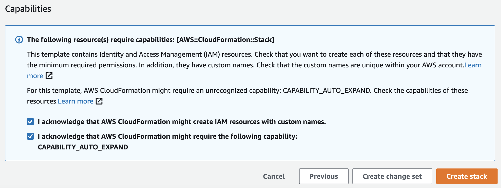
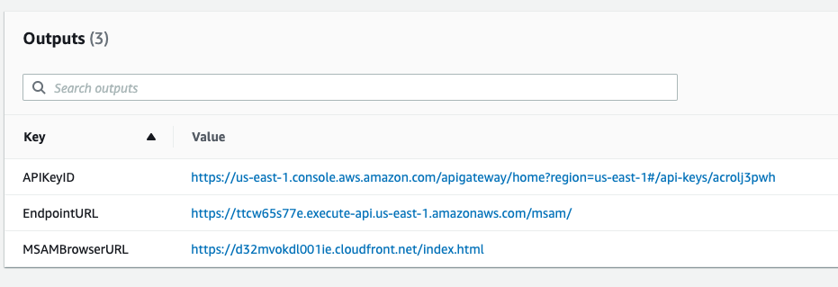
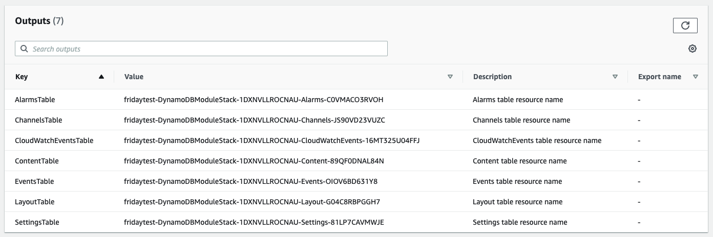
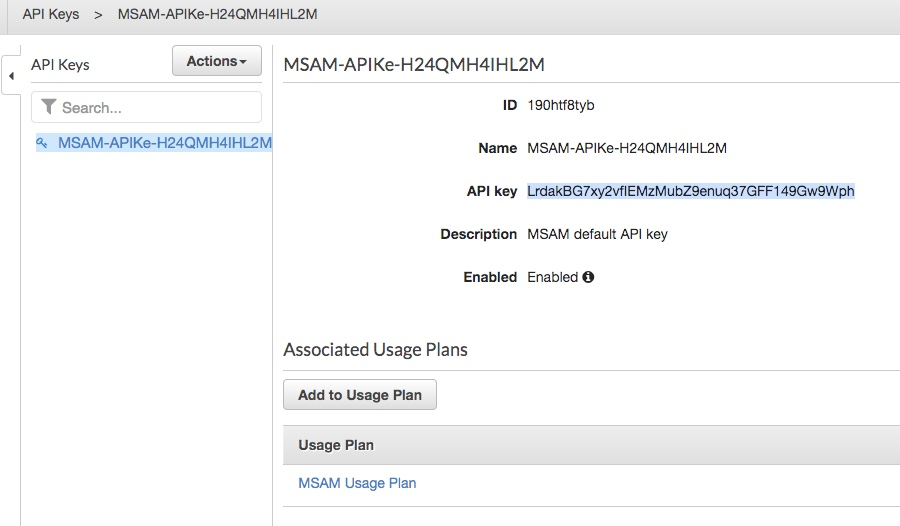

# Media Services Application Mapper (MSAM)

MSAM is installed into an AWS account using CloudFormation templates.

## Requirements for MSAM

* Amazon Web Services account
* Signed-in to the AWS console as an IAM user with AdministratorAccess role, or [sufficient permissions](#installation-permissions) to install the tool
* Google Chrome, Mozilla Firefox, Safari or another current browser with JavaScript enabled


## CloudFormation Stack Creation

* Login to CloudFormation using the same account used for creating and managing the Media Services
* Click on Create Stack

### IAM Resources

Before launching the creation of any template discussed below, the CloudFormation console may prompt you to acknowledge creation of IAM resources, as seen in the sample screenshot below. Click the check-box next to each entry. Finally, click the "Create Stack" button to start the installation process.
 


When you are installing a CloudFormation template listed below, from Choose a Template select "Specify an Amazon S3 template URL" and paste in the URL below exactly as provided for any MSAM-supported region. 

### Root Template: Install All MSAM Resources

The CloudFormation templates distributed for MSAM include a root template that installs the complete solution into a single region. The root template nests and deploys the existing five templates automatically.

`https://solutions-reference.s3.amazonaws.com/aws-media-services-application-mapper/latest/aws-media-services-application-mapper-release.template`

If you need to upgrade your installation from the individual templates to the root template, see this note below about the [migration tool](#dynamodb-table-migration-tool).

#### Input Parameters

1. Provide a stack name
2. Specify the time-to-live in seconds for all cached data, alarms, and events; see the examples next to the input for common values

#### Outputs

Go to the Outputs section of the stack, and copy and save the URL value for EndpointURL and MSAMBrowserURL. Open the link for the APIKeyID, click the Show link in the main compartment for the API key, copy the API Key and save it with the other two URL values.



After the template installation finishes and you've recorded the outputs from the template, skip forward to [Template 4: CloudWatch Event Handler](INSTALL.md#template-4-cloudwatch-event-handler) if you need to collect events and monitor alarms across multiple regions, and then to [Multiple Users and Access Control](INSTALL.md#multiple-users-and-access-control) and complete the final steps in this guide.

### Individual Templates

You still have the option to install CloudFormation templates separately. This may be an option for you if you are performing a customized installation that requires special handling between stacks, or if you have distributed responsibilities within your organization for managing your AWS accounts.

The order in which to create the stacks are as follows:

1. Create the IAM stack
2. Create the DynamoDB stack
1. Create the Core stack
1. Create the Event Handler stack
1. Create the MSAM Web stack 

Install the IAM, DynamoDB, Core and Web stacks in your main, or most accessed region only. The IAM resources installed by CloudFormation are global, although the stack you use to install them should be run in the same region as the DynamoDB, Core and other stacks. **The Event Handler stack is installed in each region Media Services are configured.**

### Template 1: IAM Resources

This template will create a stack for the IAM roles needed by MSAM and a group needed by operators for installing the stacks. 

`https://solutions-reference.s3.amazonaws.com/aws-media-services-application-mapper/latest/msam-iam-roles-release.template`

#### Input Parameters

1. Provide a stack name

#### Outputs

Go to the Outputs section of the stack and copy the four role ARNs to a notepad. You will need these as input parameters for the next templates. Also, notice the link named `InstallationGroupLink`. This link will take you to IAM to review the group created for granting installation permissions to IAM users. See the following image.


### Template 2: DynamoDB Tables

This template will create a stack for the tables, indices, and on demand capacity settings. The first time a stack is created from this template, defaults are added to scan and display cloud resources in the current region only. These settings can be updated in the tool to expand the inventory coverage to other regions.

**After installing the DynamoDB stack (Template 1), you can install the remaining stacks (Templates 2, 3, and 4) concurrently. There is no need to wait for each to finish before starting the next.**

`https://solutions-reference.s3.amazonaws.com/aws-media-services-application-mapper/latest/msam-dynamodb-release.template`

#### Input Parameters

1. Provide a stack name
2. Provide the ARN for the DynamoDB IAM role created by the IAM Resources template

#### Outputs

Go to the Outputs section of the stack and copy the seven table names to a notepad. You will need these as input parameters for the next templates. See the following image.



### Template 3: Core API and Periodic Tasks

This template will create a stack for the MSAM REST API, and periodic tasks used to refresh the content cache and discover logical resource connections.

`https://solutions-reference.s3.amazonaws.com/aws-media-services-application-mapper/latest/msam-core-release.template`

#### Input Parameters

1. Provide a stack name
1. Provide the ARN for the Core IAM role created by the IAM Resources template
1. Paste each of the table names that were generated from the DynamoDB stack
1. Specify the time-to-live for the content, event and alarm tables; content not refreshed before this time will be removed from the cache

#### Outputs

Go to the Outputs section after the stack if created and copy the EndpointURL to a notepad. See the following image for the location of the URL.


### Template 4: CloudWatch Event Handler

This template creates a stack responsible for receiving events from Media Services and CloudWatch Alarm state changes. This includes MediaLive pipeline alerts or other service state changes. Create a stack for this template in every region you will be creating and monitoring Media Services resources using Events, Aleets, and Alarms.

`https://solutions-reference.s3.amazonaws.com/aws-media-services-application-mapper/latest/msam-events-release.template`

#### Input Parameters

1. Provide a stack name
1. Provide the ARN for the Events IAM role created by the IAM Resources template
1. Paste the requested table names generated from the DynamoDB stack
1. Specify the region of the DynamoDB stack (such as us-west-2, us-east-1, or eu-west-1, for example)
1. Specify the time-to-live in seconds all recorded events; see the examples next to the input

#### Outputs

None

### Template 5: Browser Application

This template will install a copy of the MSAM browser application into an S3 bucket. Files added by the CloudFormation template will have their ACL set to `public-read` to allow access over HTTPS.

`https://solutions-reference.s3.amazonaws.com/aws-media-services-application-mapper/latest/msam-browser-app-release.template`

### Input Parameters

1. Provide a stack name
1. Provide the ARN for the Web IAM role created by the IAM Resources template

### Outputs

Go to the Outputs section of the created stack and copy the MSAMBrowserURL to a notepad, which is the root of a CloudFront distribution. This is the URL to start the application on your workstation. See the following image for the location of the URL.


## Retrieve the API Key for the REST API

The MSAM back-end requires an API key to access any of the REST endpoints. The Core API CloudFormation template creates a default API key automatically. The key is not displayed in Outputs section of the created stack. You can retrieve the key from the AWS console. **By default, no access is possible until the following steps are performed.**

1. Change to the Resources tab of the Core API stack
2. Click the link for the API Key in the Physical ID column of the Resources listing
3. Click the Show link in the main compartment for the API key
6. Copy the API Key and keep it with the Endpoint URL
  


### Multiple Users and Access Control

**You can create multiple API keys, each with different names that are provided to separate groups.**

Note that if you want to share the UI with a colleague you can do so easily by providing the browser application URL, core endpoint URL and an API key. If an API key is stolen or lost, create a new API key and delete the previous one. All users that require access can be sent the updated API key that they will have to update in the browser application. MSAM will prompt the user to update the endpoint and key if the previously used settings are unable to access the back-end.

## Start the MSAM UI 

**Wait about 5-10 minutes for the first data gathering of the services and connection mapping to complete. This is needed only the first time after creation of the MSAM instance.**

Continue to the [Usage](USAGE.md) guide to start using the tool.

### Optional Parameters

As of 1.5.0, the MSAM browser URL can be the root of the CloudFront distribution URL or with `index.html` added. These two URLs are equivalent:

`https://d1c8z4f93zrlmx.cloudfront.net/`

`https://d1c8z4f93zrlmx.cloudfront.net/index.html`

The following parameters can be used with the second form of the URL with `index.html` to customize the start-up of the browser tool.

1. **diagram** - The name of a diagram to show right after start-up
2. **endpoint** - The endpoint URL to use for the connection
3. **key** - The API key to use with the chosen endpoint URL

#### Examples

Show a default diagram named Livestream on start-up

`https://d1c8z4f93zrlmx.cloudfront.net/index.html?diagram=Livestream`

Automatically connect to an endpoint with an API key

`https://d1c8z4f93zrlmx.cloudfront.net/index.html?endpoint=https://oplfnxzh7l.execute-api.us-east-1.amazonaws.com/msam/&key=69ZSAV3tBX7YYfh1XTcsq2fLcE7Z0ETY4JXclqJJ`

**NOTE: This above parameters should only be used for secure or demonstration environments. Anyone with this URL can connect and use MSAM.**

## Installation Permissions

The CloudFormation templates provided for MSAM installation require permissions to create and configure several different types of cloud resources. The user launching the CloudFormation templates must have permissions to create the resources defined in the templates. CloudFormation will assume that user's permissions temporarily during installation to complete the steps. 

There are several options for the user installing the templates to have the correct permissions:

1. An IAM user with AdministratorAccess role attached
2. An IAM user with the provided [group](#msam-iam-resources) attached to it, or the policy file attached inline from [distribution files](dist/iam-install-policy.json)
1. Use the root user if no other options are available; using the root user is [generally discouraged](https://docs.aws.amazon.com/IAM/latest/UserGuide/id_root-user.html)

### MSAM IAM Resources

MSAM's IAM template will install a Group with an inline policy with permissions sufficient to install all the templates of the solution. The IAM Group is named `<stackname>-installationGroup-<ID>`. Add the users to this group who will be installing the solution if your organization has strict requirements about the AdministratorAccess managed policy.


## DynamoDB Considerations

There are seven DynamoDB tables used by MSAM. They are:

* [StackName]-Alarms-[ID]
* [StackName]-Channels-[ID]
* [StackName]-CloudWatchEvents-[ID]
* [StackName]-Content-[ID]
* [StackName]-Events-[ID]
* [StackName]-Layout-[ID]
* [StackName]-Settings-[ID]


The following configuration is applied by the DynamoDB CloudFormation template.

### Capacity 
Each table is configured for on-demand read and write capacity. This allows MSAM to scale it's data handling capacity from small to very large Media Services installations.

### Encryption
Each table and all indexes are configured for encryption at rest using Key Management Service (KMS) and the AWS-managed Customer Master Key (CMK) for DynamoDB in your account.

### Point-in-time Recovery
Each table is configured for point-in-time recovery. The recovery window is up to five calendar weeks. This window size is set by Amazon Web Services. You can use this type of recovery to restore one or more copies of an MSAM table to a known place in time, and then use the [migration tool](#dynamodb-table-migration-tool) described below to copy data back into the live tables after reviewing the restored results.

Read more about [Point-in-Time Recovery](https://docs.aws.amazon.com/amazondynamodb/latest/developerguide/PointInTimeRecovery.html).

## Finding Installation Content

Official released templates and other build generated files are hosted by AWS Solutions Builder.

### Release templates 
These templates are ready to use to install the latest release of MSAM.

```
https://solutions-reference.s3.amazonaws.com/aws-media-services-application-mapper/latest/aws-media-services-application-mapper-release.template
https://solutions-reference.s3.amazonaws.com/aws-media-services-application-mapper/latest/msam-browser-app-release.template
https://solutions-reference.s3.amazonaws.com/aws-media-services-application-mapper/latest/msam-core-release.template
https://solutions-reference.s3.amazonaws.com/aws-media-services-application-mapper/latest/msam-dynamodb-release.template
https://solutions-reference.s3.amazonaws.com/aws-media-services-application-mapper/latest/msam-events-release.template
https://solutions-reference.s3.amazonaws.com/aws-media-services-application-mapper/latest/msam-iam-roles-release.template
```
### Version-specific templates
Templates are available for specific releases of the solution in a named version folder.
```
https://solutions-reference.s3.amazonaws.com/aws-media-services-application-mapper/vX.X.X/aws-media-services-application-mapper-release.template
https://solutions-reference.s3.amazonaws.com/aws-media-services-application-mapper/vX.X.X/msam-browser-app-release.template
https://solutions-reference.s3.amazonaws.com/aws-media-services-application-mapper/vX.X.X/msam-core-release.template
https://solutions-reference.s3.amazonaws.com/aws-media-services-application-mapper/vX.X.X/msam-dynamodb-release.template
https://solutions-reference.s3.amazonaws.com/aws-media-services-application-mapper/vX.X.X/msam-events-release.template
https://solutions-reference.s3.amazonaws.com/aws-media-services-application-mapper/vX.X.X/msam-iam-roles-release.template
```
## Versions and Updates
Each deployed stack includes the release version number in the description. Release version numbers follow the [Semantic Versioning](https://semver.org/spec/v2.0.0.html) specification.

```
(SO0048) Media Services Application Mapper Root Stack v1.8.0
Media Services Application Mapper REST API and Tasks v1.8.0
Media Services Application Mapper Event Capture v1.8.0
Media Services Application Mapper DynamoDB Tables v1.8.0
Media Services Application Mapper Browser Application v1.8.0
Media Services Application Mapper IAM Roles v1.8.0
```

Releases prior to v1.8.0 used a different identification scheme using build timestamps that could be difficult to trace.

You can view information about the current and previous releases on the GitHub site on the [Releases](https://github.com/awslabs/aws-media-services-application-mapper/releases) page.

You can view the build version of the tool by selecting the Help menu and MSAM Build Version menu item. A dialog box will show the version of each component.

Any updates provided will be done via updates to the CloudFormation template files. In the CloudFormation console, click on the specific stack to be updated. From the top-right select Update Stack and point it to the stack link, check the IAM resource check boxes (if they are applicable to this specific update), and update the stack. 

### Upgrading Template Installation

There is not a direct upgrade path from the multiple template installation process to the new root and nested template installation process. The recommended approach for moving from the old to new process is to install a new copy of MSAM using the root template and then use our DynamoDB tool to migrate all data from the old tables to the new tables.

The advantage of this approach is that both systems can be running side-by-side after the data migration to verify everything has copied successfully. See the next section on the Migration Tool to learn more.

## DynamoDB Table Migration Tool

The Migration Tool is a Python program designed to copy data from one DynamoDB table to another. You can use this tool to copy the contents of each MSAM DynamoDB table from one installation to another. There are several reasons you might want to do this:

* Setting up a duplicate system for production and test, with the same diagrams, alarms, and layout for both
* Moving from an old to new installation of MSAM that cannot be upgraded with the templates
* Using the [Point-in-Time Recovery](https://docs.aws.amazon.com/amazondynamodb/latest/developerguide/PointInTimeRecovery.html) feature of DynamoDB to restore one or more MSAM tables to a previously known state.

### Requirements

* Python 3.x installed and available from the command line
* boto3 package is installed and accessible by the above Python
* AWS CLI profile name that is configured to access the account and DynamoDB tables used by MSAM
* Source and destination DynamoDB tables are located in the same account and same region


### Usage

```
$ python copy_table.py -h

usage: copy_table.py [-h] --source SOURCE --destination DESTINATION
                     [--region REGION] [--profile PROFILE]

Copy database items from one DynamoDB table to another.

optional arguments:
  -h, --help            show this help message and exit
  --source SOURCE       source table name
  --destination DESTINATION
                        destination table name
  --region REGION       the region where the tables reside (if not provided,
                        default is us-west-2)
  --profile PROFILE     the AWS profile to use (if not provided, default
                        profile is used)
```

### Warning
This tool copies all records from one table to another without consideration for overwrite or data loss. It will overwrite existing keys in the target table if the same keys exist in the source table.

### Example: Duplicating Tables Between Two Stacks

1. Sign-in to the AWS Console
2. Navigate to the CloudFormation console
3. Find the DynamoDB stack for the old and new stacks
4. Record the table names for each stack
5. Copy the tables from the old to new stack, skipping the Content table
6. Start the new installation of MSAM and verify tiles, diagrams, layout, alarms, etc.

#### Source Table Names

```
oldinstall-DynamoDBModuleStack-1BL5SHLW7QL8P-Alarms-1VM2MNB13D37Y
oldinstall-DynamoDBModuleStack-1BL5SHLW7QL8P-Channels-OJ059JTCKFVL
oldinstall-DynamoDBModuleStack-1BL5SHLW7QL8P-CloudWatchEvents-1LA5KI02ULY10
oldinstall-DynamoDBModuleStack-1BL5SHLW7QL8P-Content-JLLPFGYMS2LW
oldinstall-DynamoDBModuleStack-1BL5SHLW7QL8P-Events-UB108ABQTFK
oldinstall-DynamoDBModuleStack-1BL5SHLW7QL8P-Layout-SJVH87QY4VPM
oldinstall-DynamoDBModuleStack-1BL5SHLW7QL8P-Settings-1IZ5B60KHU0IL
```


#### Destination Table Names

```
freshinstall-DynamoDBModuleStack-47U9UHHXPWO0-Alarms-EXEGD9CBBRVT
freshinstall-DynamoDBModuleStack-47U9UHHXPWO0-Channels-S7H7V3GU06L8
freshinstall-DynamoDBModuleStack-47U9UHHXPWO0-CloudWatchEvents-18BSF813RQWLU
freshinstall-DynamoDBModuleStack-47U9UHHXPWO0-Content-5ZTZ0BYLED9M
freshinstall-DynamoDBModuleStack-47U9UHHXPWO0-Events-VK1R6QJ3HAL5
freshinstall-DynamoDBModuleStack-47U9UHHXPWO0-Layout-1HQ6C00JC60ZJ
freshinstall-DynamoDBModuleStack-47U9UHHXPWO0-Settings-HF5BF72M35KH
```

#### Commands

**Note:** If you don't have any user defined nodes, you may skip copying the Content table as it is populated automatically with the inventory of the selected regions in the account. 

If your source stack is missing a table, such as CloudWatchEvents, you can safely skip it.

```
python copy_table.py --source oldinstall-DynamoDBModuleStack-1BL5SHLW7QL8P-Alarms-1VM2MNB13D37Y --destination freshinstall-DynamoDBModuleStack-47U9UHHXPWO0-Alarms-EXEGD9CBBRVT --profile personal --region us-east-1
python copy_table.py --source oldinstall-DynamoDBModuleStack-1BL5SHLW7QL8P-Channels-OJ059JTCKFVL --destination freshinstall-DynamoDBModuleStack-47U9UHHXPWO0-Channels-S7H7V3GU06L8 --profile personal --region us-east-1
python copy_table.py --source oldinstall-DynamoDBModuleStack-1BL5SHLW7QL8P-CloudWatchEvents-1LA5KI02ULY10 --destination freshinstall-DynamoDBModuleStack-47U9UHHXPWO0-CloudWatchEvents-18BSF813RQWLU --profile personal --region us-east-1
python copy_table.py --source oldinstall-DynamoDBModuleStack-1BL5SHLW7QL8P-Events-UB108ABQTFK --destination freshinstall-DynamoDBModuleStack-47U9UHHXPWO0-Events-VK1R6QJ3HAL5 --profile personal --region us-east-1
python copy_table.py --source oldinstall-DynamoDBModuleStack-1BL5SHLW7QL8P-Layout-SJVH87QY4VPM --destination freshinstall-DynamoDBModuleStack-47U9UHHXPWO0-Layout-1HQ6C00JC60ZJ --profile personal --region us-east-1
python copy_table.py --source oldinstall-DynamoDBModuleStack-1BL5SHLW7QL8P-Settings-1IZ5B60KHU0IL --destination freshinstall-DynamoDBModuleStack-47U9UHHXPWO0-Settings-HF5BF72M35KH --profile personal --region us-east-1
```

**If you have user-defined nodes, you may want to copy the Content table as well:**
```
python copy_table.py --source oldinstall-DynamoDBModuleStack-1BL5SHLW7QL8P-Content-JLLPFGYMS2LW --destination freshinstall-DynamoDBModuleStack-47U9UHHXPWO0-Content-5ZTZ0BYLED9M
--profile personal --region us-east-1
```

## Raw Web Content

The MSAM browser application in zipped form is available from the following URL. The numeric value at the end of this file is the same as other files from the same build.

`https://solutions-us-west-2.s3.amazonaws.com/aws-media-services-application-mapper/vX.X.X/msam-web-NNNNNNNNNN.zip`

This file can be extracted into a web server or another type of hosting environment. Take this approach if you prefer not to use the CloudFormation template to host the application in an S3 bucket.

<a name="metrics"></a>
## Anonymous Metrics

This solution collects anonymous operational metrics to help the MSAM development team improve the quality and features of the solution. The operational metrics for this solution are the maximum count of each resource type in the MSAM inventory over the past 24 hours. The following JSON structure is an example of the metrics sent. We use this data to derive the scale, load, and storage needs placed on the application.

```
{
    "medialive-input": 6,
    "medialive-channel": 6,
    "medialive-multiplex": 0,
    "mediapackage-channel": 7,
    "mediapackage-origin-endpoint": 11,
    "mediastore-container": 0,
    "speke-keyserver": 3,
    "mediaconnect-flow": 1,
    "mediatailor-configuration": 0,
    "ec2-instances": 0,
    "link-devices": 0,
    "ssm-managed-instances": 0,
    "s3": 66,
    "cloudfront-distribution": 7
}
```

### Enable and Disable Anonymous Operational Metrics

Anonymous operational metrics are enabled by default when installing with the supplied templates.

There are two recommended ways to disable anonymous operational metrics.

#### Disable the EventBridge Rule

This is the least complicated way to disable anonymous metrics after you have installed the stacks. You can disable and enable metrics using this method without updating or changing the installation process.
* Navigate to the EventBridge console
* Find the EventBridge rule starting with the stack name and `ReportMetrics` in the name

By default the rule will be set to run every 24 hours. You can select the rule and click the disable button at the top right of the page.

#### Update the Mappings in the Core Template

* Change the Mapping shown below so the value of the `Data` key is `No`
* Upload and install the template or update an existing stack

```
"Mappings": {
  "Send": {
    "AnonymousUsage": {
      "Data": "No"
    }
  }
}
```

This will remove the associated Lambda and EventBridge Rule that periodically sends the metrics.


## Navigate

Navigate to [README](../README.md) | [Architecture](ARCHITECTURE.md) | [Workshop](WORKSHOP.md) | [Usage](USAGE.md) | [Uninstall](UNINSTALL.md) | [Rest API](REST_API.md) | [Contributing](../CONTRIBUTING.md)