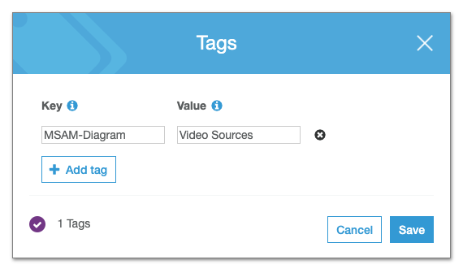
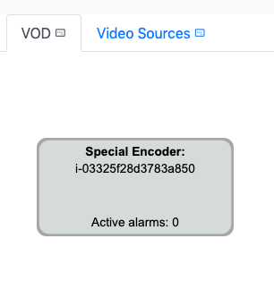

# Using Resource Tags

Resources can be tagged to automate how MSAM processes and organizes the detected inventory.

## Diagram and Tile Placement

MSAM can automatically create and add resources to a diagram with the following tags:

`MSAM-Diagram`

Set the tag value to the diagram name. If the diagram already exists, MSAM will add it there. If the diagram does not exist, MSAM will create it first and add this resource.

`MSAM-Tile`

Set the tag value to the tile name. If the tile already exists, MSAM will add it there. If the diagram does not exist, MSAM will create it first and add this resource.

### Examples

#### Diagram Tag

The following example shows assigning the `MSAM-Diagram` tag to an S3 bucket with the value `Video Sources.` 

After MSAM completes it's next scan for cloud resources in the AWS account, this bucket will appear on a diagram in the tool named `Video Sources.`

Even if you delete this diagram later, it will continue to reappear as long as this tag remains on the bucket.

#### Tile Tag

The following example shows assigning the `MSAM-Tile` tag to a MediaLive input and channel with the value `Channel 17.` Both the input and channel have the same tag and value.

After MSAM completes it's next scan for cloud resources in the AWS account, these two resources will be contained by a tile in the tool named `Channel 17.`

Even if you delete this tile later, it will continue to reappear as long as this tag remains on both or either of the resources.

## SSM Managed EC2 and Hybrid Resources

MSAM can inventory and display EC2 and Hybrid systems that are managed by AWS Systems Manager. A hybrid system may be a physical host located in an on-premise data center that can be managed from the cloud.

The `MSAM-NodeType` tag can be used to the type of a resource when it is displayed within the browser tool. The value used for this tag can be anything meaningful to your environment, such as `Video Encoder` or `Network Firewall`.

It is required to add a role to the EC2 that includes permissions to interact with AWS Systems Manager. This role includes the general permissions required: 

`arn:aws:iam::aws:policy/AmazonSSMManagedInstanceCore`

The following example shows the `MSAM-Diagram` and `MSAM-NodeType` used together on an EC2.

After MSAM completes it's next scan for cloud resources in the AWS account, this resources will be contained by a diagram in the tool named `VOD` and the type displayed on the node is `Special Encoder`.

## CloudFront Associations to MediaPackage

MSAM's connection mapping rules try to use the origin URLs in the CloudFront configuration to find the resource at the other end. There are cases where it is difficult to determine the exact origins used by CloudFront based on the URLs provided. Because of this, a tag can also be used to identify the MediaPackage origin. The tag is added to the CloudFront distribution and is checked each time MSAM updates its inventory. The connections identified via the tags are additive to any other connections found from matching origin URLs. Therefore, you should check if a connection match is made before adding one of these tags to your distribution.

There are two possible tags used by MSAM to map a distribution back to a MediaPackage origin endpoint. Each tag is different, so review the following information carefully noting the difference in the values of each tag name.

The following tag can be used to associate any CloudFront distribution to a **MediaPackage origin endpoint**. This tag has been used by several GitHub solutions that automatically build streaming video workflows including [Live Streaming on AWS](https://github.com/awslabs/live-stream-on-aws). 

`MP-Endpoint-ARN`

Set this tag's value to the ARN of the MediaPackage origin endpoint. For example:

`arn:aws:mediapackage:us-east-1:123456789012:origin_endpoints/b471320ddb7a402ca438a5ec5e50f843`

The tag below is used exclusively by MediaPackage when creating a new CloudFront distribution while also creating a new MediaPackage channel. This tag's value holds the ARN of the channel unlike the above tag's value which holds the ARN of the specific endpoint.

`mediapackage:cloudfront_assoc`

Set this tag's value to the ARN of the MediaPackage channel. For example:

`arn:aws:mediapackage:us-east-1:123456789012:channels/28d17c4b3fbf570db3c4495f35f56a14`

The following image from CloudFront shows where it is used in the tags section.

## Navigate

Navigate to [README](../README.md) | [Architecture](ARCHITECTURE.md) |  [Workshop](WORKSHOP.md) | [Install](INSTALL.md) | [Usage](USAGE.md) | [Uninstall](UNINSTALL.md) | [Rest API](REST_API.md) | [Contributing](../CONTRIBUTING.md)
