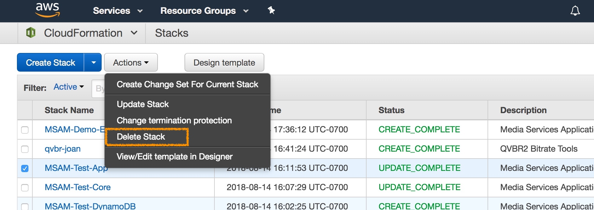

# Media Services Application Mapper (MSAM)

MSAM is removed from an AWS account using CloudFormation.

## CloudFormation Stack Deletion

Before you begin, be sure you are signed-in to the AWS console as the same user who installed the stacks, or a user with equivalent permissions.

### Events Stack

Delete the events stack from any other regions that were installed after you installed the main solution.

### Root Template/All Resources Stacks

If you used the **Root/Nested** template installation option, select the root stack in CloudFormation and click the Delete button. CloudFormation will uninstall the stacks in the opposite order they were installed.

### Individual Stacks

If you used separate templates to install the solution, be sure to delete the stacks in the opposite order they were installed.

The order in which to delete the stacks are as follows:

1. Delete MSAM Web stack 
1. Delete Event Handler stack
1. Delete Core/REST API stack
1. Delete DynamoDB stack
2. Delete IAM stack

To delete a stack:

1. Select the template you wish to delete.
2. From the **Actions** pulldown menu, select **Delete Stack**
 

## Warning

Remember to remove the DynamoDB stack after the Core and Event stacks. Other stacks are running software that access the tables. Removing the tables before removing the running software has the potential to create excessive error rates in your account which may result in service usage throttling.

## Retained Resources After Delete

The access logging bucket for the MSAM web browser application is retained after deletion to maintain history. If you no longer need this bucket or its contents, you can delete it using the AWS Console. From the S3 console, select the radio button next to the bucket name and click the `Empty` button at the top of the page. After confirming and completing, return to the S3 console page and follow the same process by selecting the bucket and clicking the `Delete` button.

## Navigate

Navigate to [README](../README.md) | [Architecture](ARCHITECTURE.md) | [Workshop](WORKSHOP.md) | [Install](INSTALL.md) | [Usage](USAGE.md) | [Rest API](REST_API.md) | [Contributing](../CONTRIBUTING.md)
