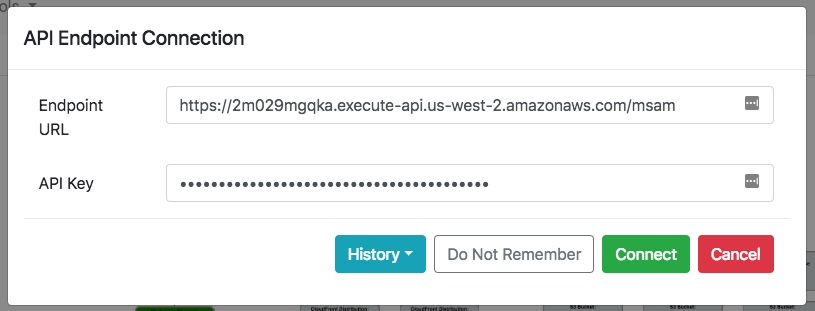
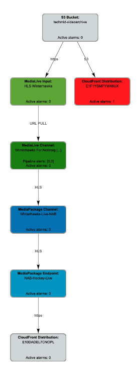
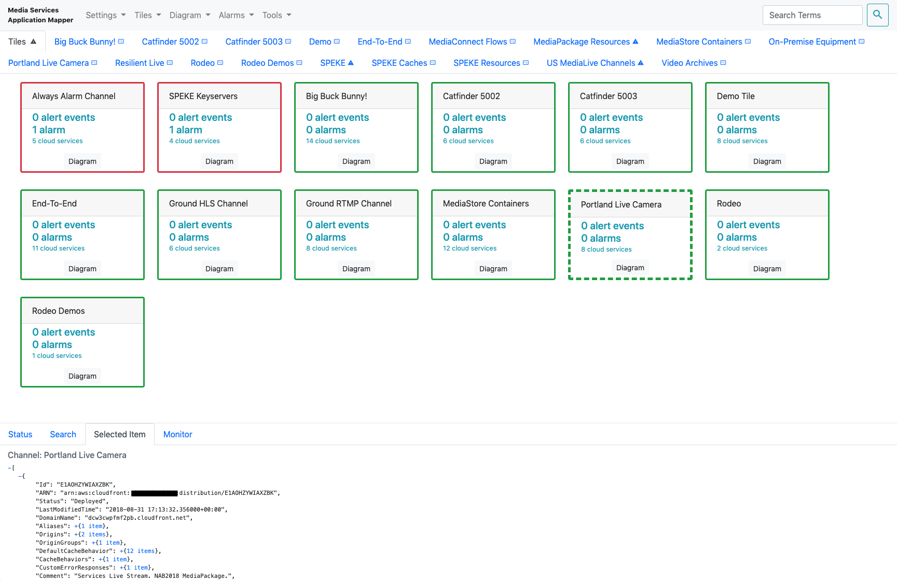

# MSAM Basic Usage

## First Run (Important)

Each time the MSAM web application is launched, the browser's locally stored cookies are checked for any previous API connection information. If a previous connection is found, it is used by the browser automatically on the next launch.

**Did you retrieve the default API key in the installation instructions?** If not, go back to [Install](INSTALL.md) and review *Retrieve the API Key for the REST API.*

When MSAM starts and a previous connection is not found, the user is prompted for an endpoint URL and API key. The tool will confirm the connection information is valid before continuing. You can save several endpoints in browser storage for easy reuse later.

Toggle the **Do Not Remember**/**Remember** button on the Connection dialog to store the endpoint and API key for recall after the browser is closed. Remembered endpoints and API keys will remain for up to seven days without use before they are removed. Using an endpoint and API key will reset its expiration timer. Remembered endpoints are listed in the **History** dropdown and can be selected for use. Select **Do Not Remember** to use this endpoint and API key only during the current browser session. 

API keys are created and removed from the API Gateway page in the AWS Console. An API key is still active until it is removed from API Gateway.

The browser application checks the settings in the cloud for the AWS regions to import from the inventory once the the tool has connected with the API. After installation, the tool will be configured to scan and import inventory from the AWS region in which it was installed. See below about the Settings menu to change the default.

Watch the status view at the bottom of the page as the tool loads content from the cloud. 

## Data Freshness

The MSAM browser application will load inventory once while it is starting. It will not automatically show additions or changes in the cloud inventory. This capability may be added in a future release. For now, you can refresh the browser page to retrieve the latest inventory from the cloud cache. Diagrams, tiles and other settings will be restored from the cloud.

## Searching for Resources, Diagrams, Tiles

Search controls are located at the upper-right of the page and inside the Search tab at the bottom of the page. Inventory in-memory, all diagrams and tiles are searched simultaneously. Search results are displayed in the **Search** tab at the lower part of the page.

Search results show several results:

* Inventory: matches that may or may not be on a tile or diagram
* Diagram names: names of diagrams that match search criteria
* Diagram contents: diagrams with inventory that match search criteria
* Tile names: names of tiles that match search criteria
* Tile contents: tiles with inventory that match search criteria

Search results may be added to an existing diagram or tile by dragging the item from the results compartment onto the diagram or tile.

## Diagrams

Diagrams are one type of visualization option in MSAM. Diagrams contain nodes that represent cloud resources, like an S3 bucket or a MediaPackage channel. Diagrams contain connections between resources that typically indicate some type of data flow between cloud resources.

When MSAM is first installed, and when you want to visualize recently discovered cloud resources, you will need to create some diagrams.

### Adding a Diagram

Diagrams are added to an MSAM installation using the Diagram/Add New Diagram menu item. Provide a unique name for the diagram and MSAM will open it for work.

### Adding Inventory

A resource from the MSAM inventory can exist on more than one diagram. Often you will see data sources participating in multiple workflows, such as an S3 bucket, MediaStore container or CloudFront distribution.

There are several approaches to populating diagrams with inventory. The first approach is to search and add resources directly to the diagram. Do this when you know what needs to be added to a diagram either by name, ARN or another unique indentifier. Use the Diagram/Manage Diagram Contents menu item to find and add items to the current diagram. The Manage Diagram Contents dialog shows the downloaded inventory on the left side and the current diagram's contents on the right side. Use the buttons in the middle to add or remove nodes from the current diagram.

You can use the keyword search at the top right of the page to find resources in inventory, search results will display in the Search tab at the bottom of the page, and then drag inventory resources you need onto the current diagram. 

Another approach is to have MSAM automatically expand the diagram from some initial contents based on connections to other nodes not yet on the diagram. First use the Diagram/Manage Diagram Contents dialog to add resources you can identify. After that, select (or multi-select) the items you've added on the diagram and use one of the following menu items to automatically expand the diagram's contents:

* Diagram/Add Downstream Connected Nodes
* Diagram/Add Upstream Connected Nodes
* Diagram/Add All Connected Nodes

The concept of upstream and downstream connections between nodes is related to the direction of the arrowhead on each connection and the implied data flow direction between nodes. Connections to downstream nodes have arrowheads pointing to the other nodes, indicating data flowing in that direction. Connections to upstream nodes have arrowheads pointing at this node, indicating data flowing from those nodes into this one. Nodes will often have one upstream connection coming to it, and potentially one or more downstream connections going from it to other nodes.

Finally, any nodes in the search results tab at the bottom of the page can be dragged onto a diagram.

### Connections

Connections between nodes are automatically added to diagrams if they known. The user does not need to do anything to manage connections between nodes. They will be removed automatically by the tool when either or both nodes supporting the connection are removed from the diagram. Connections are discovered using rules implemented by the cloud back-end of MSAM. The rules are re-evaluated periodically against the inventory to show new connections or expire old connections. 

### Custom Connections

There may be connections you want to show in your visualization that cannot be discovered. You can add custom connections between two nodes that do not have an existing connection.

When you select two nodes on diagram without an existing connection, the create connection button will appear at the far right of the navigation bar. Click this button to create a new connection between these nodes. The first node selected is assumed to be the upstream node and the second node selected is assumed to be the downstream node. The arrow will point toward the downstream node.

Selecting a custom connection will show the edit and delete connection buttons at the far right of the navigation bar. You can set the connection label and expiration data of a custom connection using the edit connection button.

Custom connections will show an attribute `"user-defined": true` in the Selected Item compartment at the bottom of the page.

### Diagram Layout

Once you have some inventory on the diagram, you will want to organize the nodes to make the diagram meaningful. Nodes can be repositioned manually, by selecting and dragging nodes to a new position. See the next sections on how to use mouse and keyboard gestures to move around the diagram and arrange diagram contents.

### Navigation

* Fit and magnification buttons are located at the bottom left of the diagram
* The fit button will resize the entire diagram to the visible page
* Movement buttons are also located at the bottom left of the diagram
* Left-click and drag the background of the diagram to reposition
* Double-click a node or near a node to zoom in to it

### Selection

* Selection notifications are shown at the far right of the navigation bar
* Select a single node by left-clicking it once
* Use the Command or Ctrl keys with left-click to select multiple items
* Select a group of items on the diagram by dragging with the **right button** pressed
* Selected nodes can be moved by dragging the nodes with the **left button** pressed

### Diagram Layout Tools

MSAM includes several simple tools to help organize and layout diagrams.

These layout tools are available from the Diagram menu:

* Layout Hierarchical Top-Bottom
* Layout Hierarchical Left-Right
* Layout Isolated Nodes

The first two menu items will reorganize the current diagram either top to bottom, or left to right. The last menu item will only layout nodes without connections. Isolated nodes layout will group the same types of nodes together into a square.

If your diagram contents don't look right after layout, or looks worse, you can toggle the Layout Method under Settings/Advanced Settings/Layout Method between Directed and Hub Size to change how the diagram is organized. Some diagrams will automatically layout better with one method over the other. One method prioritizes direction and the other prioritizes nodes with the most connections.

You can align sets of nodes vertically or horizontally using these tools from the Diagram menu:

* Align Selected Vertically
* Align Selected Horizontally

Select all the nodes you want to align. Choose one of the menu items above. The following image is an example of horizontal alignment.

The following diagram image is an example of vertical alignment.

## Tiles

A tile represents all of the cloud resources that make up a streaming channel, or some type of system or solution. A tile might include, for example, an on-premise video encoder, MediaConnect flows, an AWS MediaLive input and channel, MediaPackage channel and endpoints, SPEKE keyserver, MediaTailor instance, and CloudFront distribution. Any resource can be a member of more than one tile, such as an S3 bucket or CloudFront distribution. The alerts and alarms of a tile's resources are aggregated and communicated by visual indications on the tile.

Tiles are sorted by the total number of alarms and alerts, and then by tile name. Diagram nodes are periodically updated to visually reflect the state of subscribed alarms and alerts. Tiles reflect the aggregate status of all the cloud resources associated with the tile. The following image of a tile tab shows several tiles indicating an alarm, a selected tile (Portland Live Camera) with details in the lower compartment.

### Creating a Tile

A new tile is created several ways:

* Select the Tile tab, and choose Tiles/Add New Tile and provide a name
* Select the Tile tab, drag an existing tile to the white background and provide a name to create a copy
* Select the Tile tab, drag an existing diagram tab to the tile tab white background to create a tile with the diagram's contents

The new tile will appear in the Tile view. Tiles will automatically update every few seconds to show the latest status.

### Updating Tile Contents

You can add inventory to a tile in much the same way you add inventory to diagrams.

* Use the keyword search at the top right of the page and drag results from the bottom of the page to the tile
* Drag one tile on top of another tile to copy inventory from one tile to the other
* Drag a diagram tab on top of a tile to copy the inventory from the diagram to the tile
* From a diagram, select a node and choose Tile/Add Selected Node to Tile and select the tiles to update
* To remove inventory or rename a tile, select a tile and choose Tiles/Show/Edit Contents of Selected Tile

## Monitoring Cloud Resources

Select any item contained by a diagram or select a tile in the **Tiles** tab. Click the **Subscribed Alarms** tab or **Recent CloudWatch Events** tab at the bottom of the page to view alarms and alerts related to the resources contained by the tile.

### CloudWatch Events and Media Services Alerts

Install the `msam-events-release.json` CloudFormation template in each region as your MediaLive Channels or Multiplexes, or MediaConnect flows. Events and Alerts are automatically received into MSAM and indicated on the diagrams and tiles containing those resources. The visual items representing MediaLive will change color as Pipeline Alerts are set and cleared.

**Media Services Alerts are represented with the colors yellow and red depending on the resource's total number of pipelines and number of pipelines currently experiencing a problem.** If the number of pipelines experiencing a problem is less than the total number of pipelines, the node is drawn in yellow to indicate the resource is still moving data but without full redundancy. If all the pipelines of a resource are experiencing a problem, then the node is drawn in red to indicate a failure.

### Cloudwatch Alarms

MSAM can associate any CloudWatch alarm from any region to any node in the MSAM inventory. You will need to create CloudWatch alarms in advance of performing these steps.

1. Select one or more resources on a diagram
2. Select the Alarms menu and Subscribe Selected to Alarms menu item
3. Use the region list and column filters, and select one or more CloudWatch alarms
4. Click Save

All tiles and diagrams containing this node will reflect the current alarm state.

After a diagram node is subscribed to an alarm:

1. Select the diagram node
1. Select the Subscribed Alarms tab

The upper area of the Subscribed Alarms tab contains subscribed alarms and the lower area contains MediaLive alerts. Use the control at the far right of the monitor tab to remove an alarm from a cloud resource. The diagram item will show a state change of any subscribed alarms.

## Menus

* Settings
    * Connection Settings -- change the current connection or use a new connection to an MSAM endpoint
    * Advanced Settings
    	* CloudWatch Alarm Update Interval -- query MSAM for alarm state changes at this internal
    	* CloudWatch Event Update Interval -- query MSAM for event changes at this internal
    	* Refresh Tile Inventory Interval -- query MSAM for new and removed tiles at this interval
    	* Never Cache Regions -- a list of regions to never inventory in the cloud
    	* Layout Method -- affects how diagram nodes are arranged during horizontal or vertical layout (default is **Directed**)

* Tiles
	* Add New Tile -- add an empty tile with the specified name to the Tiles tab
	* Add Selected Node to Tile -- add the selected diagram node to an existing tile
	* Duplicate Selected Tile -- create a copy of the currently selected tile in the Tiles tab
	* Show/Edit Contents of Selected Tile -- edit the currently selected tile in the Tiles tab
	* Delete Selected Tile -- delete the selected tile in the Tiles tab (does not delete resources)

* Diagrams
	* Add New Diagram -- create an empty diagram with a name
	* Manage Diagram Contents -- open the dialog to add and remove resources from the current diagram
	* Add Downstream Connected Nodes -- add downstream resources connected to the currently selected diagram resource
	* Add Upstream Connected Nodes -- add upstream resources connected to the currently selected diagram resource
	* Add All Connected Nodes -- performs add upstream and add downstream with one action
	* Expand Selection Downstream -- select all resources connected downstream of the currently selected resource
	* Expand Selection Upstream -- select all resources connected upstream of the currently selected resource
	* Align Selected Vertically -- align selected items in a straight vertical line (adjusts X location)
	* Align Selected Horizontally -- align selected items in a straight horizontal line (adjusts Y location)
	* Layout Hierarchical Top-Bottom -- perform a layout of the current diagram organized from top to bottom
	* Layout Hierarchical Left-Right -- perform a layout of the current diagram organized from left to right
	* Layout Isolated Nodes -- perform a box layout of unconnected nodes of the same type in the current diagram
	* Remove Selected Nodes -- remove the selected nodes from the current diagram
	* Duplicate Current Diagram -- create a copy of the current diagram to a new diagram
	* Remove Current Diagram -- remove the current diagram

* Alarms
    * Subscribe to Alarms -- see below. One or more diagram nodes are selected before choosing this menu item. This operation will prompt the user to find and select one or more CloudWatch alarms to associate to the selected nodes. Any alarms can be subscribed to any nodes. The association exists only within MSAM.

* Tools -- tools are extensions that provide user-contributed functionality. Custom tools can be built and added to MSAM, and invoked from this menu.

## Navigate

Navigate to [README](../README.md) | [Architecture](ARCHITECTURE.md) | [Workshop](WORKSHOP.md) | [Install](INSTALL.md) | [Uninstall](UNINSTALL.md) | [Rest API](REST_API.md) | [Contributing](../CONTRIBUTING.md)